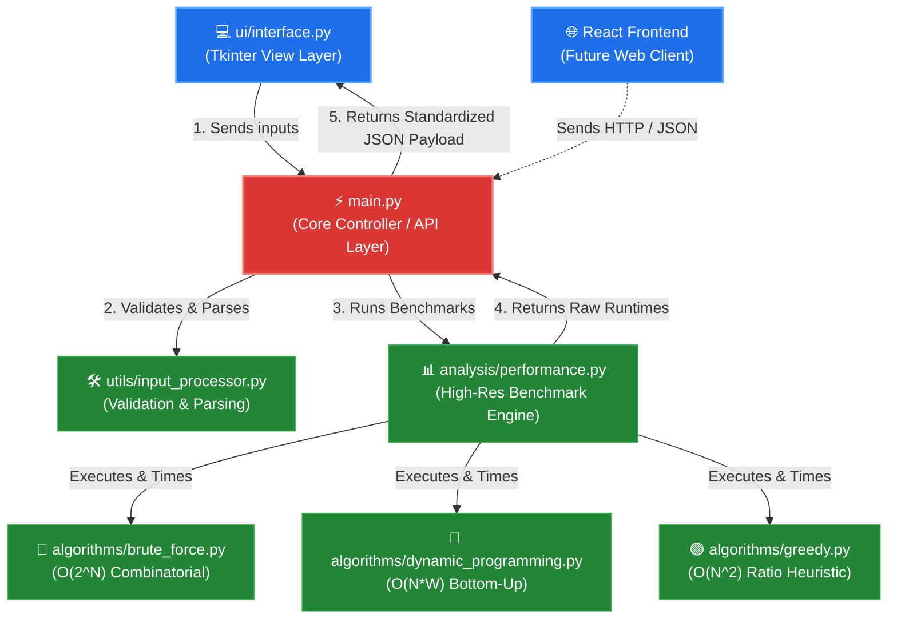

# 🎒 Knapsack Problem Solver Suite

[](https://www.python.org/)
[](LICENSE)
[]()

A premium, highly-optimized educational desktop application and performance benchmarking platform designed to solve the classical **0/1 Knapsack Problem** using multiple algorithmic paradigms: **Brute Force**, **Dynamic Programming**, and **Greedy Ratio Heuristics**.

Designed with a strict **Separation of Concerns (SoC)**, the application operates with a clean model-view-controller API layer, allowing the underlying solvers to be consumed seamlessly by either the included native Tkinter GUI or a modern React web frontend.

---

## 🗺️ System Architecture

The project is architected to decouple presentation (UI) from algorithmic computation and data processing. The entry-point API (`main.py`) acts as the central orchestrator.

### Decoupled Data Flow



---

## ⚡ Key Features

- **Multi-Algorithm Solving**: Compare exact and approximate methods in one action.
- **Microsecond-Precise Benchmarking**: Employs `time.perf_counter()` to obtain exact, system-independent runtimes.
- **Safety Thresholding**: Automatically bypasses Brute Force for inputs $N > 22$ to safeguard the execution thread.
- **Clean API Design**: `main.py` provides clean functions (`solve_knapsack_api`) returning raw, standard JSON-like dicts, abstracting all computation away from UI files.
- **Premium Tkinter Interface**: Form-based responsive layout with clean status banners and organized multi-column output displays. Includes a **Live Performance Analytics Dashboard** at the bottom of the results window, calculating exact speed ratios between algorithms (e.g., "Greedy is 5.4x faster than Dynamic Programming") in real-time.

---

## 📁 Repository Structure

```directory
KnapSack-Project/
│
├── main.py                    # 🚀 Primary Controller / Core API Layer
├── PROJECT_REQUIRMENTS.md     # 📝 Course requirements and deliverables
├── MY_WORK.md                 # 📋 Completed tasks and report drafts
├── DOCUMENTATION.md           # 📚 Full Academic & Technical Report (For TA)
│
├── algorithms/                # 🧠 Core Solver Implementations
│   ├── brute_force.py         # Exact exponential recursion
│   ├── dynamic_programming.py  # Exact bottom-up tabular solver
│   └── greedy.py              # Custom value-to-weight ratio heuristic
│
├── ui/                        # 🎨 Presentation Layer
│   └── interface.py           # Tkinter Graphical User Interface
│
├── utils/                     # 🛠️ Utility Functions
│   └── input_processor.py     # String parsing and bounds validation
│
└── analysis/                  # 📊 Benchmarking Suite
    └── performance.py         # Performance timing & benchmark scaling logic
```

---

## 🚀 Quick Start Guide

### Prerequisites
- **Python 3.8 or higher**
- No external packages are required! The solver suite uses Python's standard library to guarantee cross-machine compatibility.

### Launching the App (GUI & Web Backend)
To run the Tkinter desktop solver and boot the React Web API backend concurrently, execute the main entry point:
```bash
python main.py
```
*Note: This launches the desktop solver on your screen and starts a background daemon thread serving the React frontend on http://localhost:8000. When you close the GUI window, the backend server will automatically shut down.*

### Programmatic API Usage
You can integrate the core solving logic into other scripts (or a web server) with simple, standard API calls:

```python
from main import solve_knapsack_api

# Define raw inputs exactly as entered by a user
weights = "10, 20, 30"
values = "60, 100, 120"
capacity = "50"

# Call the API wrapper
payload = solve_knapsack_api(weights, values, capacity)

# View the raw, parsed, and timed results
print(payload["success"])  # True
print(payload["results"]["dynamic_programming"]["max_profit"])  # 220
print(payload["results"]["dynamic_programming"]["execution_time_ms"])  # ~0.024 ms
```

### Running Scaling Benchmarks
To benchmark the computational growth scaling across different sample sizes ($N = 5$ to $N = 1000$):
```python
from analysis.performance import run_scaling_benchmark

results = run_scaling_benchmark()
for res in results:
    print(f"N={res['n']} | DP: {res['dp_avg_ms']:.4f}ms | Greedy: {res['greedy_avg_ms']:.4f}ms")
```

---

## ⚛️ Modern React Frontend Dashboard

In addition to the native Tkinter GUI, this repository features a premium **Vite React Web Frontend** located in the `frontend/` directory.

Styled with **Tailwind CSS**, it features a modern side-by-side dashboard layout:
- **Left Column**: Form for entering weights/values and capacity, with row insertions/deletions and a one-click **"Demo Data" Sparkle Button**.
- **Right Column**: Displays glows for individual solver runtimes, renders selected item index chips, and calculates relative speed ratios on the fly.
- **Modular Hook-Driven Code**: Separates API states and timing fetches cleanly into custom hooks (`useKnapsack.js`).

### How to Run:
1. **Boot the Backend API Server**:
   Simply launch the main entry point:
   ```bash
   python main.py
   ```
   *(This launches the Tkinter desktop GUI and starts the Web API server on port 8000 concurrently in a background daemon thread).*

2. **Boot the React Web Interface**:
   In another terminal, navigate to the frontend folder and spin up Vite:
   ```bash
   cd frontend
   npm run dev
   ```
   *(Hosts the dashboard at http://localhost:5173).*

---

## 🛠️ Custom Solvers Integration Guide

If you wish to add a new algorithm (e.g., *Branch and Bound*):
1. Create a new file in `algorithms/` (e.g., `branch_and_bound.py`).
2. Implement your solver returning a dictionary with `max_profit` and `selected_items`.
3. Add the import and invocation within `analysis/performance.py`'s `compare_algorithms` method.
4. Your algorithm will automatically get timed, benchmarked, and rendered in the GUI!
